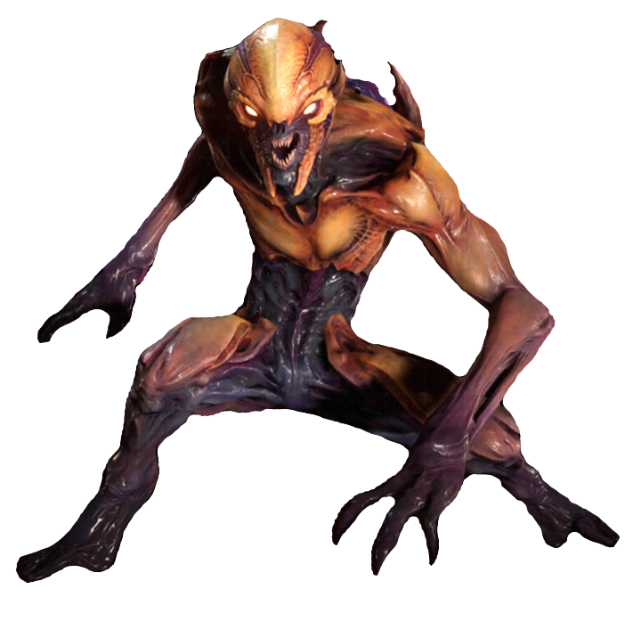

# ResearchProjectPauMotta

## _Index_
- _1.	History of AI_
   - 1.1 Enemy AI in the 1970s
   - 1.2 Deep Blue
- _2.	Immersive experiences and AI_
   - 2.1	Game Façade
   - 2.2. Doom
   - 2.3. Left 4 Dead
   - 2.4. Alien: Isolation
- _3.	Designing battle AI_
   - 3.1 Finite-State Machine (FSM)
   - 3.2 RPG Battle
- _4.	Bibliography_ 

## _1.History of AI_

### _1.1. Enemy AI in the 1970s_

Single-player games with AI enemies started to appear as early as the 1970s. Very quickly, many games were redefining the standards of what constitutes game AI. Some of those examples were released for arcade machines, such as Speed Race from Taito (a racing video game), or Qwak (a duck hunting game using a light gun), and Pursuit (an aircraft fighter) both from Atari. Other notable examples are the text-based games released for the first personal computers, such as Hunt the Wumpus and Star Trek, which also had AI enemies.
Dragon Quest introduced the tactical system for the RPG genre. Over the years, the list of games that has used artificial intelligence to create unique game concepts has expanded.

 Speed race from Taito: [Link](https://www.google.com/url?sa=i&url=https%3A%2F%2Fgifer.com%2Fen%2F17aP&psig=AOvVaw1XQN8i-2lG7kaS5Bj5ffTY&ust=1615403691622000&source=images&cd=vfe&ved=0CAIQjRxqFwoTCNjU9qL6o-8CFQAAAAAdAAAAABAD) 

 Qwak!: [Link](https://www.google.com/url?sa=i&url=https%3A%2F%2Fwww.myabandonware.com%2Fgame%2Fqwak-6sn&psig=AOvVaw2v9cDlxnDNvwPjimwvIQqp&ust=1615403904492000&source=images&cd=vfe&ved=0CAIQjRxqFwoTCIi1iIP6o-8CFQAAAAAdAAAAABAD) 

 Pursuit for the Atari: [Link](https://www.google.com/url?sa=i&url=https%3A%2F%2Fwww.youtube.com%2Fwatch%3Fv%3DUwLujdHx9Yk&psig=AOvVaw2dzgEocMpP3inXbpilTB6u&ust=1615404265802000&source=images&cd=vfe&ved=0CAIQjRxqFwoTCIDR6f33o-8CFQAAAAAdAAAAABAU) 

All of the games mentioned used the same method for the AI called finite-state machine (FSM). Here, the programmer inputs all the behaviors that are necessary for the computer to challenge the player.

### _1.2. Deep Blue_

In 1997 Deep Blue, a chess machine, won then-reigning World Chess Champion Garry Kasparov in a six-game match in 1997. The machine used an algorithm called minimax which amounted to listing the possible board states and moves it can take in the future and evaluating the value of each of those moves in the context of victory. Which involves minimizing the maximum gain of the opponent by looking as far ahead as it needs to on a decision trees there. There were a number of factors that contributed to this success, including a single-chip chess search engine, a massively parallel system with multiple levels of parallelism, a strong emphasis on search extensions, a complex evaluation function, and effective use of a Grandmaster game database.

Deep Blue:
 

## _2.Ai and immersive gameplay_

### _2.1. Game Façade_

Façade is an artificial-intelligence-based interactive story created by Michael Mateas and Andrew Stern. It was the winner of the Grand Jury Prize at the 2006 Slamdance Independent Games Festival and has been exhibited at several international art shows. 
Façade’s AI analyze what the player writes and create new responses. For example in some scenarios Grace may respond favorably to the statement 'I love your decorations.', while in another context she may believe you are being condescending to her. 

Façade coordinates the AI with the “Drama Manager”. It figures out where the plot goes depending of what happened and how each character is “feelings”. The tension between them including you (the player) as the main influencer on each character issues.

 Façade Game

### _2.2. Doom_

Doom (stylized as DooM, and later DOOM) is a video game series and media franchise created by John Carmack, John Romero, Adrian Carmack, Kevin Cloud, and Tom Hall. The series focuses on the exploits of an unnamed space marine operating under the auspices of the Union Aerospace Corporation (UAC), who fights hordes of demons and the undead.

This game is famous by its unique combat system, Push Forward Combat where the player would be driven forward instead of boing forced into cover. In addition, that was a guide for all aspects on the game, including level design, narrative and player progression. 

 Doom death animation by an Imp:

On the enemies AI design, the designer’s team describe them as a small palette and simple role. It has to be easy for players to understand (be able to describe them in one sentence) and predictable in their actions in order to be confident enough in that combat.
One example of an enemy that explains very well the idea o push forward combat is the Imp.

 Enemy Imp:

Its role is quite obvious from silhouette and teaches the player that have to dodge his projectile. Moreover, their small size and jumpy nature makes players caches after them.

### _2.3. Left 4 Dead_

Left 4 Dead is a 2008 multiplayer survival horror game developed by Valve South and published by Valve. It sets you in a zombie apocalypse with the goal to reach the end of the map.

This excited and stressful gameplay is driven by the Left 4 Dead Director, an AI agent who manipulates what is happening on the scene depending on the skill of the player and the stress level of the player, composed by the number of zombies attacking, the proximity to the player (if they are closer to you, you will be more stress) and is some special enemy is attacking the player. The AI system measures each player stress level meaning that the director will focus on player which stress levels are lower than others.

 Left 4 Dead

This is a crucial component of the game because reinforces the idea of you can’t stay on the same place for too long, there is a need to keep moving and pay attention to what is happening around you.

### _2.4. Alien: Isolation_

Alien: Isolation is a 2014 survival horror video game developed by Creative Assembly and published by Sega originally for Microsoft Windows, PlayStation. Based on the Alien science fiction horror film series, the game is set 15 years after the events of the original 1979 film Alien, and follows engineer Amanda Ripley, daughter of Alien protagonist Ellen Ripley, as she investigates the disappearance of her mother.

The Xenophormer was built in the idea of the “pshycopath serendipity” which the alien always find itself in the right place at the right time. Even if you’re in hiding and the monster can’t see you, and it doesn’t know your ultimate goal, it will still find a way to mess with your plans. 

The unique part of this game is the powerlessness of the main character, you cannot kill the alien, which means you have to find ways to avoid the direct contact with her.

In order to create and AI that suits on the type of game they were looking for. To achieve this, the game uses 2 different behavior management system: The Macro AI and the Micro AI. The Macro AI is the director, which observes the player all the time though the game, meanwhile the Micro AI is seated on the Alien itself. The director’s job is to point the alien in the direction of the player periodically, to give it a hint as to where it should be looking. Despite this, the alien is never allowed to cheat: while the director always knows where you are, the alien has to figure it out for himself. 
While the alien is near the player, the menace gauge would increase depending on specific factors:
-	Whether the creature is within a short walking distance of the player.
-	Whether the player has actual line of sight on the alien.
-	Whether the alien was close on the motion tracker, but could also reach the player quickly.
The last item is particularly important, as the alien could technically be close on the motion tracker but in another room. As such, the threat won’t increase at the same rate given the threat is minimal.

 Alien:

## _3.Designing battle AI_

###_3.1. Finite-state Machine (FSM)_

A finite-state machine is a model used to represent and control execution flow. It is perfect for implementing AI in games, producing great results without a complex code.

A finite-state machine is a model of computation based on a hypothetical machine made of one or more states. Only a single state can be active at the same time, so the machine must transition from one state to another in order to perform different actions. Transitioning depending of which trigger was active.

 Easy FSM diagram:

An FSM can be represented by a graph, where the nodes are the states and the edges are the transitions. Each edge has a label informing when the transition should happen, like the player is near label in the figure above, which indicates that the machine will transition from wander to attack if the player is near.

Some examples of an FMS in games are the Pacman enemies were each of them have a specific behavior. Nevertheless, when Pacman eats a power pallet their behavior changes. 

 FSM form Pac Man:

### _3.2. RPG Battles_

When we design PRG Enemy AI we need to take into account what type of entity we are doing, is a melee character, a range character or a supportive character. Moreover, we need to think is some of these characters have skills that can be used on combat or not. 

In some RPG Turn base combat the enemies knows about the opposing party members in order to select the target to attack. There are few logics that we can use to determine the attacker’s target. The closest to the attacker, the farthest to the attacker, the one with most current HP, the one with the least current HP, always attack a specific type of the party member.

The next step is to attack, this can be a normal attack or a skill. Each attacker will have a different percentage between a normal and skill attack, some will use normal attack more often others will use more skill based attacks. Of course, in case of skill based attacks, we will first check whether or not the attacker’s current SP is sufficient for the attack or the skill is on cool down.

For example, the Epic Seven is a mobile game RPG Turn Based Combat where each enemy have their own type of logic. Despite of the enemy AI will always attack a random target but the unit that is placed in the front has the highest chance of getting attacked. Some enemies will always use a basic attack. If there are a special boss the first attack they will be a skill.

 Epic Seven:

## _4.Bibliography_

[https://forums.rpgmakerweb.com/index.php?threads/enemy-ai-design.124200/](https://forums.rpgmakerweb.com/index.php?threads/enemy-ai-design.124200/)

[https://www.youtube.com/watch?v=wh9kpe1Dn8s](https://www.youtube.com/watch?v=wh9kpe1Dn8s)

[https://www.youtube.com/watch?v=POv1cOX8xUM&t=516s](https://www.youtube.com/watch?v=POv1cOX8xUM&t=516s)

[https://www.youtube.com/watch?v=2KQNpQD8Ayo](https://www.youtube.com/watch?v=2KQNpQD8Ayo)

[https://www.youtube.com/watch?v=WbHMxo11HcU](https://www.youtube.com/watch?v=WbHMxo11HcU)

[https://gamedevacademy.org/construct-2-rpg-tutorial-designing-the-battle-ai/](https://gamedevacademy.org/construct-2-rpg-tutorial-designing-the-battle-ai/)

[https://en.wikipedia.org/wiki/Alien:_Isolation](https://en.wikipedia.org/wiki/Alien:_Isolation)

[https://www.youtube.com/watch?v=Nt1XmiDwxhY](https://www.youtube.com/watch?v=Nt1XmiDwxhY)

[https://www.gamasutra.com/blogs/TommyThompson/20171031/308027/The_Perfect_Organism_The_AI_of_Alien_Isolation.php](https://www.gamasutra.com/blogs/TommyThompson/20171031/308027/The_Perfect_Organism_The_AI_of_Alien_Isolation.php)

[https://becominghuman.ai/the-perfect-organism-d350c05d8960](https://becominghuman.ai/the-perfect-organism-d350c05d8960)

[https://gamedevelopment.tutsplus.com/tutorials/finite-state-machines-theory-and-implementation--gamedev-11867](https://gamedevelopment.tutsplus.com/tutorials/finite-state-machines-theory-and-implementation--gamedev-11867)

[https://game8.co/games/Epic-Seven/archives/275491#hl_2](https://game8.co/games/Epic-Seven/archives/275491#hl_2)

[https://www.gamedev.net/tutorials/programming/artificial-intelligence/how-artificial-intelligence-has-shaped-the-history-of-gaming-r4782/](https://www.gamedev.net/tutorials/programming/artificial-intelligence/how-artificial-intelligence-has-shaped-the-history-of-gaming-r4782/)
